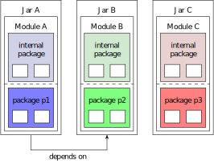
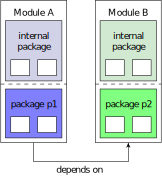

# Introduction

In average 36% of development time of software systems is used on repaying 
technical debt [@Besker2017].
Technical debt is a term coined by Ward Cunningham and is used to explain to
non-technical stakeholders the need for "refactoring", i.e. changing and
improving the internal workings of software products, without adding new
features for end-users [@Kruchten2012; @Cunningham1992].
While some immature code may be acceptable to deliver a product faster, it 
should be rewritten promptly, as it negatively affects the maintainability of 
software.
In analogy to the financial term, Cunningham considers time spend on
"not-quite-right code" interest on technical debt.

Nowadays, software libraries and platforms are commonly used to improve code
reuse, increase productivity and consequently reduce cost [@Brito2018].
While tackling technical debt is usually invisible to users, changes in
dependencies often entail requiring adaptions in dependent code.
Software libraries usually value compatibility with previous versions highly to
not frighten off users with high effort to adapt to new versions.
Additional technical debt is created by keeping on using outdated and 
unsupported versions of a library.
Future development may be simplified, but migrating to newer versions does not
add additional value to a product.

However, not always is technical debt caused by making wrong choices in
development originally, but simply by the passing of time, so that in retrospect
a choice is not quite right [@Kruchten2012].

This was also the reason for a recent change in the Java platform -- the 
introduction of a module system -- with version 9.
New ways of distributing applications, such as App Stores on mobile operating
systems or in Docker containers, and the rise of newer platforms like Go and
Swift required a fundamental change in order to keep the Java platform relevant 
[@Reinhold2018].

The module system fundamentally changes how code artifacts are organized and
distributed, which breaks backwards compatibility with previous versions.
Although several ways of migrating stepwise to the new system and utilizing the
new features only partly, the new version is only slowly adapted.
The impact of a migration to Java 9 is not yet fully understood, especially the
problems such a migration causes and the required effort is unclear.

While the topic of software maintenance in general and especially software 
migration is well studied [@Besker2017; @Chapin2001; @Malton2001; @Mancl2001; @Mayrhauser1995]
and also the migration of applications to different programming languages is
covered [@Martin2002], not much literature exists on the topic of migrating 
applications to newer versions of the same language.
There are also several studies on the topic of +API stability [@Brito2018; @Dig2006],
which is a big factor for backwards compatibility.
Migration to Java 9 is mainly described in online documentation [@Oracle2017],
text books [@Inden2018; @Kothagal2017; @Mac2017] and online experience
reports [@Parlog2017].
This sparse literature also contributes to the uncertainty a migration to Java
9 encompasses.
While some migration guides of artificial applications exist 
(see e.g. [@Kothagal2017]), and also a case study on migrating an already modular 
application to Java 9 exists [@Gee2017],
to the best of the authors knowledge this is the first in-depth case study on
migrating a real-world Java 8 application to Java 9.

The goal of this thesis is to assess the difficulties that developers encounter
when migrating applications from Java 8 to Java 9.
To achieve this, the migration was performed exemplarily on the open source
bibliography manager JabRef.
JabRef was chosen, because it is a large, well maintained Java 8 application and
it being open source makes it easy to find expertise regarding its architecture
and source code.
In [@sec:background], first the topic of software migration in general is 
examined, then the advantages of and the way Java implements modules are 
analyzed, and the software JabRef is presented.
[@sec:approach] describes the iterative approach of the migration process 
applied to JabRef and the encountered problems.
Then the software was also divided into several smaller modules, which is
explained in [@sec:modularization].
Finally, future work will be outlined in [@sec:future] and the thesis concludes 
in [@sec:conclusion].

# Background {#sec:background}

## Software Migration {#sec:migration}

> What migration type is relevant for this thesis?
> What problems do they pose?
> Are there any studies for each of these types?

Software migration is a part of software maintenance [@Dig2006]. 
In general software maintenance can be classified as adaptive, corrective, 
perfective, and preventive maintenance tasks [@Malton2001]. 
Within this classification, software migration is an adaptive maintenance task: 
Adapting existing software to a new environment or platform.

The need to perform a software migration usually arises, because the current 
platform or environment is obsolete or poorly supported, or from features 
available only in newer versions of a platform [@Malton2001].

Software migration tasks can be grouped into three general classes:

* **Dialect conversion** is required when the underlying compiler technology
  changes to a new version of the compiler or a new compiler family 
  [@Malton2001]. Usually successive versions of compilers aim at being backwards
  compatible, even when new features were added, in large code bases, however,
  additional effort is required to use new versions of compilers.

  Not much literature exists on the topic of this type of migration.
  Often when a new version of a compiler introduces incompatibilities with
  previous versions, a migration guide is issued by the compiler maintainers
  [@Miller; @GHCM].

* **+API migration** is the process of changing a dependency on an external
  +API to another one or a different version [@Malton2001].

  Similar to other software, libraries that provide an +API evolve over time, to
  introduce new features, fix bugs, and refactor source code [@Xavier2017].
  ++API establish a contract with the clients, that rely on them, hence ++API
  should have a high stability to minimize effort for clients when updating to
  a newer version.
  However, not all changes in ++API are breaking the previously established
  contract, changes that do are referred to as *breaking changes*.

  Breaking changes mainly are modification or removal of existing +API
  elements [@Brito2018]. Adding new +API elements are rarely braking changes.

  Usually libraries also contain code that is intended only for implementing the
  services offered by an +API, but not for public consumption [@Dig2006].
  Many languages do not provide features to explicitly mark such elements as
  internal, but library authors rely solely on naming conventions, e.g. placing
  code in an `internal` namespace.

  In [@Bartolomei2009] Bartolomei et al. identify two general approaches for
  API migrations:
  When a source +API should be replaced with a target +API, either all usages of
  the source +API can be directly replaced with corresponding calls to the
  target +API, or a wrapper around the target +API can be created with the
  interface of the source +API.
  They note that the difficulty of an +API migration greatly depends on the
  differences both ++API have.
  Hora and Valente propose a tool that tracks what ++API open source projects
  use and when and to which ++API they migrate in [@Hora2015].
  This aims at supporting software engineers finding replacement ++API.

* **Language migration** is the decision to convert an existing program to a new
  language [@Malton2001]. This is a risky type of migration, as it requires much
  effort to re-express source code in a different language.

  This type of migration is well studied:
  Kontogiannis et al. perform a migration of a system written in PL/IX to C++ in
  [@Kontogiannis1998]. 
  They find that a problem is simulating language constructs of the source
  language that is not available in the target language.
  Terekhov and Verhoef argue in [@Terekhov2000] that too much effort is put
  on automatic tooling aiding in the conversion, but instead the focus should
  lay on the software engineers performing the migration.
  Martin and Müller present their approach for migrating C programs to Java in
  [@Martin2002].
  They use an automatic tool to perform the migration and find that often,
  manual adjustments are required to obtain readable code in the target
  language.   

For this thesis mostly the groups of dialect migration and +API migration are
relevant.
The language Java will be kept, but only updated to a new version.
This mostly corresponds to a dialect conversion.
However, as will be described later, the ++API available in the Java language
also have changed at some parts, so also an +API migration is relevant.

The general approach for adaptive software maintenance consists of a sequence of
steps as shown in [@fig:adaptive_maintenance].

![Activities of adaptive software maintenance [@Mayrhauser1995]](images/adaptive_approach.svg){#fig:adaptive_maintenance}

Applied to a migration process, the sequence of steps consists of first
understanding the system. Then the changes in the new environment or platform 
need to be understood in order to understand the new requirements to the system.
The next step is to develop a plan of how the new requirements can be 
implemented in the system. Next, the planned changes can be implemented, which
may require debugging. Lastly, regression tests should be ran, to ensure that
the system is still completely functional in the new environment.

## Java 9 {#sec:j9}

The Java programming language was originally developed by Sun Microsystems under 
the name Oak in 1991 [@Oracle2015].
Oak was designed to be processor-independent and should be used in consumer 
electronics such as TV set-top boxes. 
In 1992 the industry had little interest in Oak, so the developers switched to 
bringing the language to the internet. 
The WebRunner browser was released in 1994, being the first browser supporting 
moving objects and dynamic executable content by supporting Oak.
Due to trademark issues Oak was renamed to Java in 1995.
In the same year the developers of the Netscape Navigator browser announced that
they will include Java support. 
The first version of Java was then released in 1996.
In 2009 Oracle acquired Sun and since then is the maintainer of the language
[@Oracle2015].

Since its origin, Java has a very good history of being backwards compatible with previous 
releases [@Marx2016; @Oracle2018d; @Oracle2018f; @Oracle2018c; @Oracle2018a; @Oracle2018b; @Oracle2018; @Oracle2018e].
According to Oracle, incompatibilities usually occur only in rarely used edge-
cases, or when new keywords were introduced in the language, such as `strictfp`
in Java 2, `assert` in Java 4 and `enum` in Java 5, which subsequently can no
longer be used as identifiers.

Backwards compatibility in programming languages is a double-edged sword: It
promotes reuse of code and programming skills, but languages attempting a
significant degree of historical consistency inevitably perpetrate some 
problematic constructs [@McIver1996].

**To do: Scala, C/C++, ???**

With Java 9 arguably the biggest change since its inception was introduced among    
minor changes: the *Java Platform Module System* (+JPMS) -- also popular under
its working name *Jigsaw* [@Mac2017].
Even though backwards compatibility is a top priority for Java, Java 9
introduced breaking changes requiring additional migration effort.
+JPMS adds *modules*, which are identifiable artifacts containing code, to the 
Java language [@Mac2017].
The monolithic +JDK itself was also split into smaller modules [@Clark2017].

Since Java 9 the release cycle has also adapted to a faster pace [@Reinhold2018].
Beginning with Java 9, a feature release will be published every six months and
long term support (+LTS) releases will be released every three years. Because of 
this, Java 9 is already superseded by Java 10 as of writing, and Java 11, the 
next +LTS release, is expected to be released in September 2018.

### Advantages of Modules {#sec:j9_adv}

Before Java 9, artifacts were usually distributed as *Java archives* (++JAR)
[@Kothagal2017]. Java has a concept of a classpath, which is a path in the
file system Java searches for compiled code required at runtime or compilation.
[@fig:classpath] shows a schematic image of a classpath as it would be specified
to Java. This classpath has 4 +JAR files on it, each containing several packages.
The white rectangles symbolize classes in the packages.

![Unresolved Classpath before Java 9 [@Kothagal2017]](images/classpath.svg){#fig:classpath}

Before Java 9, the information of how packages and classes are organized was
ignored by Java [@Kothagal2017]. Java resolves classes on demand when they are
first required. [@fig:classpath_resolved] shows the information that is 
available to Java. All contents of the ++JAR on the classpath are seen as if it
were only one artifact.

![Resolved classpath before Java 9 [@Kothagal2017]](images/classpath_resolved.svg){#fig:classpath_resolved}

This way of handing loading of classes led to several problems: The first one
being accessibility [@Kothagal2017]. Every code artifact can essentially use
code of every other artifacts, as long as classes or members are not restricted
with the existing access modifiers (see [@tbl:access]). This can make dependency
relations unclear for large code bases and violates strong encapsulation 
principles.

Access modifier | Class    | Package  | Subclass | Unrestricted
----------------|----------|----------|----------|--------------
`public`        | \checked | \checked | \checked | \checked
`protected`     | \checked | \checked | \checked |
- *(default)*   | \checked | \checked |          |
`private`       | \checked |          |          |

: Access modifiers and their associated scopes [@Mac2017] {#tbl:access}

This becomes even more problematic with the second problem: If more than one 
type exists with the same fully qualified name, i.e. the package name and the 
type name is the same, the first one found is used [@Kothagal2017]. This problem 
most often occurs when different versions of the same libraries are put on the 
classpath and is referred to as *+JAR hell*. As classes are loaded lazily, those
problems might not even be noticed on startup of an application, but only when
it was running for some time and a class is used for the first time. Thus
reliable configuration of the classpath is difficult and explains the rise of
tools like Maven or Gradle, that standardize the process of obtaining 
dependencies and configuring Java to use them [@Kothagal2017].

+JPMS aims at exactly these needs of large Java applications: reliable 
configuration and strong encapsulation [@Clark2017].

Modules have to explicitly declare which packages they make available to other
modules and which modules they are dependent on [@Mac2017].
Packages that are not exported by a module can not be used in other modules.
This clearly separates public +API from code that is intended for internal use 
only. Consequently internal code can also change freely without worrying about 
introducing breaking changes.

From the declaration of dependencies a so-called module graph 
([@fig:module_graph]) can be derived to identify dependencies of modules.
The nodes of the graph represent the modules of the application, the dark blue
edges represent the explicitly declared dependencies, while the light blue 
edges represent the implicit dependency of every module on the Java base module 
`java.base` [@Reinhold2016].

![Module graph [@Reinhold2016]](images/module_graph.png){#fig:module_graph}

Java 9 resolves modules every time before an application is compiled or executed 
[@Kothagal2017]. Thus, it is possible to catch configuration errors like 
missing modules or multiple modules with the same name directly at startup.

The modules are resolved from the module path Java 9 introduced [@Mac2017].
While it is still possible with Java 9 to use non-modular code with the
classpath, modular code should be placed on the module path.
Modules are still distributed as ++JAR, but if a +JAR contains a module it is
referred to as a *modular +JAR*, the file format however is the same as for
regular ++JAR.

[@fig:modulepath] shows an schematic module path as it would be specified to
Java.
This example has three modular ++JAR on the module path, containing module A, B
and C respectively.
Here the only dependency is from module A to module B.

{#fig:modulepath}

In contrast to the classpath, the module path only resolves the required
modules based on the context [@Mac2017].
So if for example a main class `MainA` in module A should be executed, the
module path would be resolved as shown in [@fig:modulepath_resolved].
Only module A and B, but not module C would actually be resolved, as it is not
required by module A nor B.

{#fig:modulepath_resolved}

In a different context, the same module path may be resolved differently.
If for example another module D would be compiled with the module path above,
and module D depends on the modules A and C, then all three modules would be
resolved.
This resolution of modules amounts to calculating the transitive closure in the
available modules.

This resolve strategy brings also an additional benefit with it: Java 9 is
better equipped to be run on devices for the Internet of Things (+IoT) 
[@Inden2018].
The modularization of the +JDK itself allows to only distribute modules that are
required to run an application instead of the full +JDK.
+IoT devices often have heavy restrictions on storage space, so that shipping
a large monolithic +JDK on such devices would be unacceptable.

### Modular Code before Java 9 {#sec:j9_before}

Although modular code was not available to the Java at the language level, there
are tools and libraries that provide similar functionality.

Many projects use a build tool to automate building source code, the most widely
used ones in the Java ecosystem being +ANT (Another Neat Tool), Apache Maven and 
Gradle [@Muschko2014].
The main goals of build tools are removing manual interaction, creating
repeatable builds and making builds repeatable.
Build tools let users express the tasks that need to be executed in order to
build an artifact in an build file.
Those tasks are ordered and thus are internally represented as a directed 
acyclic graph (+DAG), to model dependencies on other tasks [@McIntosh2012].

A key feature of build tools is the declaration of dependencies a project
requires [@Muschko2014]. [@fig:maven] shows how the build tool Maven resolves
dependencies: It first interprets the build script -- in the case of Maven a
Project Object Model (+POM) file -- checks the local cache if the dependency is
already available on the local machine, and else downloads the required 
artifacts from a central Maven repository.
Gradle implements similar dependency management functionality.

![Maven's interaction with Maven Central to resolve and download dependencies for a build [@Muschko2014]](images/maven.svg){#fig:maven}

Since dependencies in the central Maven repository must also declare their
dependencies, the dependencies of dependencies -- so called 
*transitive dependencies* -- can also be automatically be resolved [@Muschko2014].

Dependency management of Maven and Gradle is not limited to external libraries,
but also supports decomposition of software into modules.
While these modules can theoretically be accessed from every other module at
runtime as described in [@sec:j9_adv], only the declared dependencies are put
on the classpath on compile-time.

The explicit declaration of dependencies, the ability to create a dependency
graph by resolving external libraries and their transitive dependencies, and
the possibility to define modules gives build tools similar functionality to
+JPMS.
However, in contrast to +JPMS build tools do not alter any behavior at runtime.
While build tools handle the configuration of the classpath at compile-time,
misconfiguration may still happen at runtime.
Build tools -- especially the resolving of dependencies -- can be used in
parallel with +JPMS.

Another way of achieving modularity in Java before Java 9 is provided by the
OSGi framework [@Reinhold2017a]. 
OSGi goes beyond the functionality of +JPMS and provides in addition to a module
system also a life-cycle management and a service registry.

The framework implements the module system by using custom classloaders -- the 
mechanism Java uses to load classes -- and metadata distributed in the manifest
`META-INF/MANIFEST.MF` file of the module, which are called bundles by OSGi 
[@Hall2011].
[@lst:osgi-manifest] shows an example manifest of a bundle.
Similar to +JPMS the bundle declares its name, the packages it exports and the
packages it will use from other bundles among other metadata.

```{#lst:osgi-manifest .json caption="OSGi bundle metadata [@Hall2011]"}
Manifest-Version: 1.0
Created-By: 1.4 (Sun Microsystems Inc.)
Bundle-ManifestVersion: 2
Bundle-SymbolicName: org.foo.api
Bundle-Version: 1.0.0.SNAPSHOT
Bundle-Name: Simple Paint API
Export-Package: org.foo.api
Import-Package: javax.swing,org.foo.api
Bundle-License: http://www.opensource.org/licenses/apache2.0.php
```

In contrast to +JPMS, OSGi bundles also have a certain life-cycle as shown in
[@fig:osgi_lifecycle] [@Hall2011].
Bundles first need to be installed, they then are resolved. They then can be
started and stopped at runtime. They also can be updated or even uninstalled at
runtime.

This makes OSGi's module system much more dynamic than +JPMS and explains why
it is commonly used as a plugin system to allow extending application's 
functionality [@Hall2011].

![OSGi bundle life-cycle [@Hall2011]](images/osgi_lifecycle.svg){#fig:osgi_lifecycle}

The OSGi framework also provides an approach to implement a service oriented
architecture (+SOA) [@Hall2011].
As shown in [@fig:osgi_services], OSGi bundles can provide a description of the
services they provide in the form of XML files.
OSGi has a service registry, where the provided services are registered and can
be looked up by other bundles to use them.

![OSGi service registry [@Hall2011]](images/osgi_services.svg){#fig:osgi_services}

In comparison to +JPMS, OSGi provides much more elaborated features.
However, JSR 376 specifying Java's module system states, that OSGi only can
address the issue of reliable configuration, but not the issue of strong
encapsulation as it is itself built on top of the Java platform [@Reinhold2017a].
Similar to the above mentioned build tools, OSGi can also be used together with 
Java 9.

### JPMS' Modules {#sec:j9_impl}

To make use of +JPMS in Java 9 a module has to declare its public packages and
its dependencies as mentioned in [@sec:j9_adv]. This is done using a module
descriptor, a file called `module-info.java` in the root package, that will be
compiled as classes to a file called `module-info.class` [@Mac2017]. 
[@lst:module-desc] shows the module descriptor of the default Java module
`java.prefs` that contains Java's Preferences +API as an example^[Most examples in [@sec:j9_impl] were taken from the source code of Oracle's JDK version 9.0.4. The source code is available in `${JAVA_HOME}/lib/src.zip`.].

```{#lst:module-desc .java caption="Excerpt of module descriptor of `java.prefs`"}
module java.prefs {
    requires java.xml;

    exports java.util.prefs;
    // [...]
}
```

This module declares a dependency on the module `java.xml`, that contains Java's
++API +JAXP (Java +API for +XML Processing), +StAX (Streaming +API for +XML),
+SAX (Simple +API for +XML) and the +W3C Document Object Model (+DOM) +API with
a `requires` clause.
It also makes the package `java.util.prefs` available for other modules by
exporting it and uses a service of the type
`java.util.prefs.PreferencesFactory`.
However, although Java packages seem to be hierarchical with a `.` to sperate
levels, package names are treated as arbitrary identifiers [@Mac2017].
This means if a subpackage of `java.util.prefs` were to be exported here, it
would have to be explicitly declared as exported.

As shown in [@sec:j9_adv], from such module descriptors can be derived.
In +JPMS, there are two important concepts to reason about relations between
modules: *Readability* and *Accessibility* [@Mac2017].

Reading another module means the types of its exported packages can be
accessed by other modules [@Mac2017].
Readability relations between modules can be set up using the `requires` clause
in the module descriptor.
By definition every module reads itself, but the reads relation is by default
not transitive.

So inside the `java.prefs` module, accessing types from the `java.xml` module
like the `Document` type is allowed as shown in the excerpt of the class
`java.util.prefs.XmlSupport` in [@lst:reads-example], but a module that only
`requires java.prefs` can not access types from `java.xml`.

```{#lst:reads-example .java caption="Excerpt of `java.util.prefs.XmlSupport`"}
package java.util.prefs;
// ...
import org.w3c.dom.*;
// ...
class XmlSupport {
    static void importPreferences(InputStream is)
        throws IOException, InvalidPreferencesFormatException
    {
        try {
            Document doc = loadPrefsDoc(is);
            // ...
        }
    }
    // ...
}
```

If a transitive reads relation is required, modules can declare that with a
`requires transitive` clause as shown for Java's `java.sql` module in
[@lst:java.xml].
This module not only requires the modules `java.logging` and `java.sql`, but
also all of the modules that are required by these modules.

```{#lst:java.xml .java caption="Excerpt of module descriptor of `java.sql`"}
module java.sql {
    requires transitive java.logging;
    requires transitive java.xml;

    exports java.sql;
    exports javax.sql;
    exports javax.transaction.xa;
    // [...]
}
```

The second concept is accessibility.
As shown in [@sec:j9_adv] accessibility was already a concept before Java 9.
Combining accessibility with readability achieves the strong encapsulation that
was a goal of +JPMS [@Mac2017].
The verification that a type T in package P from module M1
is accessible from module M2 is threefold:

1. Does M2 read M1?
2. If it does, does M1 export the package P?
3. Is type T accessible in package P?

This makes only public types in exported packages accessible from other modules,
non-public types are blocked from use with the traditional accessibility rules
as shown in [@sec:j9_adv].
Another change in +JPMS concerns Java's reflection. Reflection is a form of
metaprogramming, i.e. a program can generate or modify parts of itself.
Before Java 9 it was possible to change accessibility of classes and their
members at runtime as shown in [@lst:reflection].
This example reflectively sets the method `someMethod()` of an object accessible
regardless wheter it was accessible before or not and invokes it.

```{#lst:reflection .java caption="Changing accessibility at runtime using reflection"}
public static void callInaccessibleMethod(Object object)
        throws Exception {
    Method method = object.getClass().getMethod("someMethod");
    method.setAccessible(true);
    method.invoke(object);
}
```

This is no longer possible with Java 9, unless a package is declared as an 
*open package* or the whole module is defined as *open module* [@Mac2017].
This is done using the `opens` clause on a package in the module descriptor.
[@lst:jdk.unsupported] shows how this is done in Java's module `jdk.unsupported`
as an example.
This allows reflection in the packages `sun.misc` and `sun.reflect` from any
module that requires this module.

```{#lst:jdk.unsupported .java caption="Module descriptor of `jdk.unsupported`"}
module jdk.unsupported {
    exports sun.misc;
    exports sun.reflect;
    exports com.sun.nio.file;

    opens sun.misc;
    opens sun.reflect;
}
```

Alternatively, if all packages should be open for reflection, the module can be
declared as `open module module.name {}`.
However, open packages are not exported automatically, likewise are the packages
of an open module not exported [@Mac2017].
If open packages should also be exported, an explicit `exports` clause is
required.

+JPMS allows even more fine grained control of accessibility: Both `exports` and
`opens` clauses also have a qualified variant, where the modules, that are
allowed to access the exported or opened packages, are explicitly specified
[@Mac2017].
This is for example done in Java's module `java.xml.ws` as shown in
[@lst:java.xml.ws], that opens its package `javax.xml.ws.wsaddressing` only to
the `java.xml.bind` module.

```{#lst:java.xml.ws .java caption="Excerpt of the module descriptor of `java.xml.ws`"}
module java.xml.ws {
    // [...]
    opens javax.xml.ws.wsaddressing to java.xml.bind;
    // [...]
}
```

This has applications for ++API that rely heavily on reflection.
In the above example, the opened package contains entities that are serialized
to +XML using +JAXB (Java Architecture for +XML Binding), that requires the
reflective access to the package to read the annotations of the classes, but
other modules should not be able to access those classes.

+JPMS also implements strong encapsulation by providing a way for modules to
declare services they provide and use [@Mac2017].
Services are +JPMS' dependency injection (+DI) mechanism, also known as the
principle of Inversion of Control (+IoC), that hides implementation details from
consumers.

An example of how this is used in the +JDK itself is shown in [@lst:java.base].
This module contains the +NIO  (Non-blocking Input/Output) +API, that can work
with several file systems.
The abstract class `java.nio.file.spi.FileSystemProvider` provides the interface
to create `FileSystem` instances for different types of file systems.

```{#lst:java.base .java caption="Excerpt of the module descriptor of `java.base`"}
module java.base {
    // [...]
    exports java.nio;
    // [...]
    uses java.nio.file.spi.FileSystemProvider;
    // [...]
}
```

This `FileSystemProvider` service is provided at multiple instances in the +JDK
itself.
One example of implemented file system is the ZIP file system that maps files
in a ZIP file as a virtual file system.
This file system is implemented in the module `jdk.zipfs`, [@lst:jdk.zipfs]
shows its module descriptor.

```{#lst:jdk.zipfs .java caption="Module descriptor of `jdk.zipfs`"}
module jdk.zipfs {
    provides java.nio.file.spi.FileSystemProvider 
        with jdk.nio.zipfs.ZipFileSystemProvider;
}
```

This module does not export or open any packages, but only provide an
implementation of the `FileSystemProvider` service.
This can be done, because the actual implementation does not matter for the
consumer, so the concrete class that implements the service must not even be
known to clients.
[@lst:service-usage] shows how the `FileSystemProvider` services are loaded at
runtime.
Additional implementations could be simply added on the module path and could
then be used transparently to consumers of the +API.

```{#lst:service-usage .java caption="Usage of JPMS' services"}
package java.nio.file.spi;
// [...]
public abstract class FileSystemProvider {
    // [...]
    private static List<FileSystemProvider> loadInstalledProviders() {
        List<FileSystemProvider> list = new ArrayList<>();

        ServiceLoader<FileSystemProvider> sl = ServiceLoader
            .load(FileSystemProvider.class, 
                ClassLoader.getSystemClassLoader());

        // ServiceConfigurationError may be throw here
        for (FileSystemProvider provider: sl) {
            // [...]
        }
        return list;
    }
    // [...]
}
```

Although a module descriptor is required to utilize the full set of features of
+JPMS, two alternatives were implemented in Java 9 to allow usage of older
libraries.

The first alternative is the so-called *unnamed module*, which aggregates all
sources put on the classpath [@Inden2018].
Thus only one unnamed module exists.
Secondly, there are so-called *automatic modules* [@Mac2017].
++JAR that do not have a module descriptor but are put on the module path are
interpreted as automatic modules.

However, both come with downsides [@Mac2017; @Inden2018]:
First, they can not declare the packages they export, so they export every
package.
Second, they can not declare their dependencies, so automatic modules are
treated as if they had declared a `requires transitive` clause on every other
resolved module on the module path in addition to the unnamed module.
The unnamed module however can not read any module, all dependencies need to be
on the classpath, too.

In contrast to the unnamed modules, automatic modules require a module name
[@Mac2017].
This name is derived from the attribute `Automatic-Module-Name` in the +JAR
manifest `META-INF/MANIFEST.MF` or from the +JAR file name if that attribute is
not present.

Although explicit modules are far more powerful, both have a justified
existence.
The unnamed module can be used to when one does not want to use +JPMS and
wants to migrate to Java 9 with minimal effort.
Automatic modules are useful when one needs to compile an application or library
with a previous Java version.
Since Java is not forward compatible, code compiled with a later Java version is
not runnable with a previous version, e.g. a library compiled with Java 9 can
not be executed on a Java 8 platform.
Since the module descriptor is a feature only from Java 9 on and many libraries
support still support Java 8 or even previous versions, library maintainers
often chose to distribute their library as an automatic module.
Hence, migrating Java libraries to Java 9 with +JPMS would force all clients of
the library to also migrate to Java 9, if they want to use the latest version of
the library.

### Migrating to Modular Code {#sec:j9_mig}

Oracle claims, that code that uses only official Java ++API should work without
changes, but some third-party libraries may need to be upgraded [@Oracle2018g].
However, in reality there are some more constraints of the module system that 
need consideration.

Firstly, due to the modularization of the +JDK itself, internal ++API became
unavailable [@Mac2017]. Those classes were always meant to be used only 
internally by the +JDK, but due to the missing access restrictions and missing
alternatives, they have become adopted by some developers.

For widely used internal classes the module `jdk.unsupported` is provided,
so that backwards compatibility for applications depending on them is ensured,
however it is planned that those classes are replaced with supported 
alternatives in a future Java version [@Mac2017].

While Java 9 provides to modify and partly circumvent the module system with
command line switches to both the Java launcher `java` and the Java compiler
`javac` as shown in [@tbl:commandline_flags], the only long-term solution is to
move away from deprecated, unsupported ++API and find supported replacement 
solutions [@Inden2018].
The command line switches can be used to override module descriptors to export
packages or open packages to reflection, or manually add a reads relation 
between modules.
The `--add-opens` switch is only available for `java`, as reflective access is
not validated at compile-time.
The switch `--add-modules` makes Java resolve additional modules, that are not
explicitly declared as required from other modules.
It also has the special values `ALL-DEFAULT`
With the `--patch-module` additional files and classes can be added to a module.
This is useful for example to add unit tests to a module, that otherwise could
not access the required classes in the module.
The `--illegal-access` switch specifies how illegal reflective access should be
handled at runtime.
Possible values for the switch are `permit`, `warn`, `debug` and `deny`.
`permit` allows all reflective access, so both reflective as well as static
access to encapsulated code is possible as it was before Java 9.
`warn` does the same as `permit`, but prints a warning every time an illegal
access orccurs.
`debug` does the same as `warn`, but prints a complete stack trace when an
illegal access occurs.
`deny` denies all illegal accesses, except those explicitly allowed with other
command line switches such as `--add-opens`.

--------------------------------------------------------------------------------
Switch                  `java`      `javac`     Function
----------------------- ----------- ----------- --------------------------------
`--add-exports`         \checked    \checked    Adds additional exported 
                                                packages in the form 
                                                `module/package=targetmodule`.
                                                           
`--add-reads`           \checked    \checked    Updates a module to read a 
                                                target module. Specified in 
                                                the form `module=targetmodule`.
                                                
`--add-opens`           \checked                Updates a module to open a 
                                                package to a target module. 
                                                Specified in the form 
                                                `module/package=targetmodule`.
                                                
`--add-modules`         \checked    \checked    Specifies additional modules
                                                to resolve. Specified as
                                                `module[,module]` or a special
                                                value.
                                                
`--patch-module`        \checked    \checked    Overrides or augments a module
                                                with classes or resources.
                                                Specified as 
                                                `module=file[,file]`.

`--illegal-access=`     \checked                Specifies how illegal access
                                                should be handled at runtime.
--------------------------------------------------------------------------------

: Command line switches to enable easy migration to Java 9 [@OracleDocJava; @OracleDocJavac] {#tbl:commandline_flags}

The second restriction is that modules are no longer allowed to have split
packages [@Mac2017]. Split packages are packages with the same name, that are
contained in two or more modules.
[@fig:split_packages] shows two modules where both contain the packages 
`splitpackage` and `splitpackage.internal`.
This example considers the package `splitpackage` to be exported, and the
package `splitpackage.internal` to be not exported.

{#fig:split_packages}

As mentioned in [@sec:j9_adv], split packages were already a problem before
Java 9.
If this were allowed, a class with the same name could be defined in both
modules and it would become unclear from which module the class should be
loaded [@Mac2017].

Although not exported split packages would theoretically not cause any issues
in the encapsulation, as it would be clear for each module to use its own split
package, also this case is not allowed [@Mac2017].
The same classloader is used for loading both modules, and each classloader may
only have a single definition of each package, regardless whether it is
encapsulated or not.

When creating modules from scratch, the solution to avoid split package is to
not create them in the first place, when migrating existing applications to
Java 9, the packages must be renamed or both packages put into one module
[@Mac2017].

Split packages across libraries cause runtime or compile-time errors such as the 
one shown in [@lst:split-pkg-err].

```{#lst:split-pkg-err .c caption="Compiler error on split packages"}
error: the unnamed module reads package splitpackage from both module.one 
and module.two
error: the unnamed module reads package splitpackage.internal from both
module.one and module.two
```

The only exception when split packages are allowed, is when they occur between
automatic modules and the unnamed module [@Mac2017].
However, in that case the package from the automatic module will be used.
The package in the unnamed module will be ignored.
The common practice to override or augment packages of the +JDK by putting
libraries containing packages of the +JDK does no longer work in Java 9.

## JabRef Bibliography Manager {#sec:jabref}

JabRef is a free open source bibliography reference manager using the standard
LaTeX bibliography format BibTeX as its native file format.
The project is hosted on 
GitHub^[[https://github.com/JabRef/jabref](https://github.com/JabRef/jabref)] 
and currently has over 200 contributors and around 140,000 lines of Java code.

JabRef aims at assisting researchers to organize their references for thesises,
papers and other scientific work.
It has a wide range of features, that help collecting literature, organizing and
sharing it when working in a team.
The interfaces with online scientific catalogs such as Google Scholar, CrossRef
or IEEE Xplore allow searching for articles and directly importing it into a
local database.
JabRef's integrations with popular applications like TeXstudio or LibreOffice
allow users to insert citations easily.

Similar features are provided by the application Zotero^[[https://www.zotero.org/](https://www.zotero.org/)].
Like JabRef, Zotero is also open source software for managing bibliography.
The focus of Zotero lies more on integrating well with word processors, wheras
JabRef focuses more on the integration with LaTeX.

Another similar application for organizing literature is Mendeley^[[https://www.mendeley.com/](https://www.mendeley.com/)].
Mendeley supports mobile platforms iOS and Android, additionally to the
desktop platforms Microsoft Windows, OS X and Linux, that JabRef supports.
Similar to JabRef, Mendeley also supports sharing databases, but then stores
databases on their servers.

A propriatiary alternative is Citavi^[[https://citavi.com](https://citavi.com)].
While a free version is available, this version has a limit on 100 articles
per database.
In general the features of Citavi and JabRef are different that Citavi is more
intended as an application to organize knowledge, instead of limiting itself to
just literature as JabRef does.

According to a survey carried out in 2015 across its users, JabRef is most 
commonly used by German, English and French speakers [@JabRefDevelopers2015]. It 
is most commonly used in professional work, such as engineering and medicine and
for studies, mostly from the field of natural sciences and formal sciences.

JabRef is built using a layered architecture as shown in [@fig:architecture] 
[@JabRefDevelopers2017]. The shown components only depend on components lower in 
the figure. The base of the architecture is the *Model* component, that 
encapsulates the entities used in the application. Building on top of that 
component is the *Logic* component, that contains all business logic. The 
*Preferences* component provides the functionality to load and store user 
defined settings. JabRef's command line interface is encapsulated in the *+CLI* 
component and the top layer is constituted by the graphical user interface in 
the *+GUI* component. Additionally, there exist some additional global classes, 
that may be used anywhere in the application.

{#fig:architecture}

The communication between the components of JabRef is implemented using an event 
bus, that allows publishing events and registering listeners for events. This 
allows to react upon changes in the core and still react in the upper layers, 
while keeping the components clearly separated.

Currently JabRef is build using Java 8 and does not run nor compile with Java 9.
Since November 2017 its open source community works on compiling JabRef with
Java 9^[[https://github.com/JabRef/jabref/pull/3421](https://github.com/JabRef/jabref/pull/3421)].
The current version of JabRef has 88 dependencies on third-party libraries,
including transitive dependencies.

The source code of JabRef is build using the tool Gradle. Gradle automates
repeated tasks such as compilation of the source code, building release 
distributions, resolving correct versions of dependencies, running tests and 
generation of source code with parser generators.

# Migrating JabRef to Java 9 {#sec:approach}

The following section covers the process of migrating JabRef from Java 8 to 
Java 9. 
Due to the open source nature of JabRef development of the project continued 
during the migration phase.
Therefore the migration technique as shown in [@sec:migration] was applied in an 
iterative approach and changes to the current version were continuously 
synchronized to the Java 9 version.

[@fig:approach] shows the general approach of the migration. The approach is
substantially different depending on whether an issue is located in an external
dependency or in JabRef's codebase. When the issues were fixed in a future
version of a third-party library, the solution simply consists of upgrading said 
dependency, otherwise the issues were reported to the maintainers of the 
respective libraries or a code contribution to their projects was created.

{#fig:approach}

Issues in JabRef internal code can be classified into access to now internal +API
and changes in the Java compiler. The only sustainable solution to those 
problems is migrating away from the +API and finding a supported replacement.
Changes in the compiler are usually only minor, but require adaption of the 
code.

## Compile-Time Compatibility {#sec:jr_mig}

In the first iteration the focus lay on ensuring compile-time compatibility with
Java 9.
Incompatible parts of JabRef were temporarily removed.

A number of external libraries were incompatible with Java 9 and also had to be 
removed.
The incompatibilities of these libraries can be categorized into the following 
categories.

At first, the popular utility libary *Google Guava*, the +SDK of the office
suite *LibreOffice*, Microsoft's monitoring service *ApplicationInsignts* and
*ArchUnit*, a test frame work to check for architecture constraints, caused
problems because of split packages.

While Google Guava did not actually contain a split package itself, it had a
dependency on an unofficial implementation of Java annotations as specified by
the Java Specification Request (+JSR) 305, that aims at assisting tools to find
software defects by providing annotations such as `@NonNull` [@Pugh2006].
This implementation declares its annotations in the package `javax.annotation`,
however, this a package used by the +JDK itself.
However, this dependency was optional and thus not required at runtime, so the
solution was to explicitly exclude it in the Gradle build script as shown in
[@lst:jsr-exclusion].

```{#lst:jsr-exclusion .java caption="Exclusion of the JSR 305 dependency"}
configurations {
    // [...]

    compile {
        exclude group: 'com.google.code.findbugs', module: 'jsr305'
    }
}
```

For ArchUnit a development version was already available, so it could simply be
updated.
The LibreOffice +SDK and Microsoft ApplicationInsights were incompatible with
Java 9, so for the first iteration, they were temporarily removed and the 
features of JabRef depending on them disabled.

Second, the +GUI libraries *Spin* and *ControlsFX* and JabRef itself used internal
++API in the +JDK, that were no longer accessible. For the first iteration, the
solution was to simply use the flags mentioned in [@sec:j9_mig] to allow the
access to those libraries.
[@lst:jr-args] shows the command line arguments required to run JabRef in the 
first iteration.

```{#lst:jr-args .bash caption="Command line arguments required to run JabRef in iteration 1"}
java \
    --illegal-access=debug \
    --add-opens javafx.swing/javafx.embed.swing=org.jabref \
    --add-opens java.desktop/java.awt=spin \
    --add-opens javafx.controls/javafx.scene.control=org.jabref \
    --add-exports javafx.base/com.sun.javafx.runtime=controlsfx \
    -p . \
    -m org.jabref/org.jabref.JabRefMain
```

The third problem for compile-time compatibility were the module names of some
dependencies. As mentioned in [@sec:j9_mig] Java first searches for a module
descriptor, if it can not be found the `Automatic-Module-Name` attribute in the
+JAR manifest is consulted and if that is not present, Java derives a module name
from the file name of the +JAR file.
However, module names underlie the same restrictions as Java packages, so they
may contain dots, but each segment between two dots must be a valid Java 
identifier.

This was a problem for Scala dependencies that follow the default Scala naming
scheme consisting of the name of the project followed by an underscore followed
by the Scala version.
So an artifact with the name `latex2unicode` for Scala 2.11 results in an 
artifact with the name `latex2unicode_2.12.jar`. 
For this, Java 9 derives the module name `latex2unicode.2.12`, which is an 
invalid module name as the 2 directly follows a dot.
For the first iteration the Scala dependency *latex2unicode*, which JabRef uses
to resolve LaTeX commands to plain text, that had again dependencies on the 
Scala libraries *fastparse* and *Sourcecode*, was temporarily removed.

Fourth, there were minor incompatibilities with the new compiler regarding the
use of Java generics. The method `children()` in [@lst:compiler-before] returns
an object of the type `Enumeration<TreeNode>`, before Java 9 however, it could
be assigned to a variable of the type `Enumeration<CheckableTreeNode>` where
`CheckableTreeNode` inherits `TreeNode`.

```{#lst:compiler-before .java caption="Use of generics before Java 9"}
Enumeration<CheckableTreeNode> tmpChildren = this.children();
for (CheckableTreeNode child : Collections.list(tmpChildren)) {
    child.setSelected(bSelected);
}
```

This direct conversion is no longer possible in Java 9. The returned object of
`children()` is assigned to a variable of the correct type 
`Enumeration<TreeNode>` in [@lst:compiler-after] and cast to the type 
`CheckableTreeNode` on usage.

```{#lst:compiler-after .java caption="Use of generics after Java 9"}
Enumeration<TreeNode> tmpChildren = this.children();
for (TreeNode child : Collections.list(tmpChildren)) {
    ((CheckableTreeNode) child).setSelected(bSelected);
}
```

Several instances of that problem were found throughout JabRef's source code,
however no documentation could be found that explains this change in the
Java language.

Lastly, as a result of the first iteration also a module descriptor was created 
for JabRef (see [@sec:j9_impl]).
While it would have been possible to make JabRef an automatic module, instead of
an explicit one, there were already efforts for creating a descriptor due to the
open source nature of JabRef.

**To do: explain the descriptor more**

[@lst:jabref-module] shows an excerpt from the module descriptor. 
The module was declared as open module to allow all internal access into JabRef,
because the architecture of JabRef (see [@sec:jabref]) is based around an 
event bus provided by the Google Guava library, which makes extensive use of
reflection.

```{#lst:jabref-module .java caption="JabRef's module descriptor"}
open module org.jabref {
    exports org.jabref;

    exports org.jabref.gui;
    // [...]

    // SQL
    requires java.sql;
    requires postgresql;

    // JavaFX
    requires javafx.graphics;
    requires javafx.swing;

    // [...]

    provides com.airhacks.afterburner.views.ResourceLocator
        with org.jabref.gui.util.JabRefResourceLocator;
    
    provides com.airhacks.afterburner.injection.PresenterFactory
        with org.jabref.gui.DefaultInjector;

    // [...]
}
```

An event bus is an implementation of the Observer pattern, implementing a
publish-subscribe style communication.
The event bus handles the dispatching of events without requiring publishers to
explicitly know who the subscribers are or vice-versa.
As shown in [@lst:guava], Guava uses annotations, such as the `@Subscribe`
annotation, to register event listeners in an event bus.
Those annotations are accessed using reflection, thus Guava requires the
packages to be open.
Since the event bus is an integral part of JabRef and is used across many
packages, the whole module was declared as open, instead of opening each package
on its own.

```{#lst:guava .java caption="Excerpt of JabRef's `BibDatabase`"}
package org.jabref.model.database;
// [...]
public class BibDatabase {
    // [...]
    @Subscribe
    private void relayEntryChangeEvent(FieldChangedEvent event) {
        eventBus.post(event);
    }
    // [...]
}
```

## Upgrading Libraries

In the second iteration the focus lay on updating the libraries removed in
iteration one to versions that are compatible with Java 9.
Not much work was done on JabRef itself, but getting in contact with library 
maintainers and participation in their open source projects was the main
objective.

### LibreOffice

JabRef uses the LibreOffice +SDK to insert citations and references into 
LibreOffice documents.
However, the +SDK consists of multiple artifacts all exporting the same package
`com.sun.star`, so they are incompatible with +JPMS due to a split package
(see [@sec:jr_mig]). 
Thus the complete +SDK and JabRef's functionality to interface with LibreOffice
was temporarily removed.

Possible long-term solutions include bundling all artifacts as one artifact, so
the LibreOffice +SDK is no longer modular, but requires consumers to load all of
it. 
The problem of the split package however would be solved, as the +SDK is then
only one module to export the package.
Another solution could be to rename the packages contained in each artifact,
this however would break backwards-compatibility of the +SDK.

The issue was reported to the Document Foundation, the maintainer of LibreOffice^[[https://bugs.documentfoundation.org//show_bug.cgi?id=117331](https://bugs.documentfoundation.org//show_bug.cgi?id=117331)].
[@tbl:lo-split] shows the development on the bug report.

| Date          | Action                                                       |
| ------------- | ------------------------------------------------------------ |
| 2018-04-29    | Bug Report Created                                           |
| 2018-06-07    | Bug Confirmed by another user                                |

: Timeline of the bug report of the split package in LibreOffice {#tbl:lo-split}

As the developers of LibreOffice were unresponsive to the bug report as of 
writing, a possible workaround to the problem would be to manually repackage the 
artifacts to a single one as proposed above. However, doing this without support 
of the original developers would complicate the build process of JabRef, because 
the patched artifact would need to be shipped with the source code instead of
downloading the dependencies from a central Maven repository as it is done for
other dependencies.

### Latex2Unicode

Latex2Unicode is written in Scala and has dependencies on three other Scala
libraries.
As briefly shown in [@sec:jr_mig] Scala's default naming scheme generates
invalid automatic module names, so latex2unicode had to be temporarily removed
in iteration one.

Since Scala does not yet support +JPMS, the solution of this problem is to
explicitly provide an `Automatic-Module-Name` attribute in the libraries
manifest (see [@sec:j9_impl]).
This was proposed to the library maintainer of 
latex2unicode^[[https://github.com/tomtung/latex2unicode/pull/11](https://github.com/tomtung/latex2unicode/pull/11)]
and to the maintainers of the dependent libraries 
fastparse^[[https://github.com/lihaoyi/fastparse/pull/185](https://github.com/lihaoyi/fastparse/pull/185)]
and sourcecode^[[https://github.com/lihaoyi/sourcecode/pull/49](https://github.com/lihaoyi/sourcecode/pull/49)]
in the form of code contributions -- so called pull requests -- to their 
libraries.

[@tbl:l2u-split] shows the timeline of the bug report for latex2unicode.

| Date          | Action                                                       |
| ------------- | ------------------------------------------------------------ |
| 2018-04-28    | Bug report created                                           |
| 2018-05-18    | Code contribution provided                                   |
| 2018-05-29    | Proposed fix accepted by library maintainer                  |

: Timeline of the bug report for latex2unicode {#tbl:l2u-split}

The maintainer of latex2unicode accepted the code contribution, but no version
including the fixes were released as of writing.
The maintainer of the dependencies fastparse and sourcecode remained 
unresponsive to the proposed fixes both provided on 2018-05-18 as of writing.
Possible solutions to work around the problem include providing a manually 
patched version of the libraries or using a service such as 
Jitpack^[[https://jitpack.io](https://jitpack.io)] to build the versions 
including provided code contribution. Jitpack allows developers to publish
versions of their libraries directly from a Git repository without additional
configuration.

### Microsoft ApplicationInsights

ApplicationInsights follows the practice to distribute so called fat ++JAR --
Java artifacts including all required dependencies -- but additionally relocate
the packages of dependencies under their own package prefix.
So their dependency on Google Guava using the package `com.google.common` is
distributed in ApplicationInsights as 
`com.microsoft.applicationinsights.core.dependencies.googlecommon`.

However, Guava also exports the package `com.google.thirdparty`.
This package was not correctly relocated in ApplicationInsights, causing a 
split package conflict with JabRef's dependency on Google Guava.

The problem was reported to the library maintainers of ApplicationInsights^[[https://github.com/Microsoft/ApplicationInsights-Java/issues/661](https://github.com/Microsoft/ApplicationInsights-Java/issues/661)].
[@tbl:ai-split] shows the timeline of the bug report.

| Date          | Action                                                       |
| ------------- | ------------------------------------------------------------ |
| 2018-05-05    | Bug Report Created                                           |
| 2018-06-08    | Bug fixed by maintainers of the library                      |
| 2018-07-31    | Version including fix published                              |

: Timeline of the bug report of missed package relocation in Google Guava {#tbl:ai-split}

### JavaFxSVG

JavaFxSVG is a library that allows the +GUI framework JavaFX to display SVG
graphics.
The library exports the package `org.w3c.dom` which conflicts with ++API provided
directly from the +JDK.
However, this functionality was used at only one occasion -- to display the 
JabRef logo in an About dialog -- so in agreement with the JabRef developers the 
library was removed and replaced with JavaFX's native capabilities.

{#fig:jabref width=100px height=100px}

JavaFX does not support the full set of features of the SVG definition, but it
has support for its so called paths specifying vertices of geometric shapes.
JabRef's logo consists of six such paths as shown in [@fig:jabref]. The solution
was to overlay the paths in order to recreate the complete image (see [@lst:logo-fxml]).

```{#lst:logo-fxml .xml caption="Rendering of JabRef Logo with JavaFX"}
<StackPane onMouseClicked="#openJabrefWebsite" scaleX="0.6" scaleY="0.6" 
    prefWidth="140" prefHeight="140" BorderPane.alignment="CENTER">
    <!-- SVGPaths need to be wrapped in a Pane to get them to the same 
    size -->
    <Pane prefHeight="350" prefWidth="350" styleClass="logo-pane">
        <SVGPath content="M97.2 87.1C93.2 33.8 18.4 14.6 18.2 ..." />
    </Pane>
    <Pane prefHeight="350" prefWidth="350" styleClass="logo-pane">
        <SVGPath content="M96.2 61.2C92.8 19.2 35.1 0.4 35 ..." />
    </Pane>
    <!-- ... -->
</StackPane>
```

## Reworking JabRef's Threading Model

The third iteration of migrating JabRef to Java 9 consisted in reworking parts
of its threading model. The rework was required because JabRef used the library
"Spin" to simplify interaction of the +GUI with long-running background tasks.
Spin provides utilities to load off time-intensive operations to a separate
thread, so that the +GUI stays responsive to user input.

This is done by creating proxy objects that run their operations on a separate
thread, but wait until their execution has finished, while keeping the +GUI 
thread responsive (see [@fig:spin]).

![Model of Spin [@Meier2007]](images/spin.svg){#fig:spin}

However, the JabRef developers are in the process of migrating from the Swing
+GUI framework, that Spin was written for, to the newer +GUI framework JavaFX.
This migration process already lead to some threading issues, because often +GUI
frameworks restrict programmatic interactions with +GUI components to be only
allowed on the +GUI thread -- sometimes also called event dispatch thread (+EDT). 
This migration process made the usage of Spin obsolete, as it does not work with 
JavaFX.

The solution to this problem was to adapt the approach of JabRef, that was 
already employed in parts of the application. JabRef uses an callback based
approach partly provided by the JavaFX framework itself.
This approach provides a class `BackgroundTask` that wraps time consuming 
operations and provides means to specify callbacks that are executed on the +GUI
thread once the operations succeeds, fails or either of the two.

```{#lst:background_task .java caption="Usage of background tasks"}
BackgroundTask.wrap(this::verifyDuplicates)
              .onSuccess(this::handleDuplicates)
              .executeWith(Globals.TASK_EXECUTOR);
```

[@lst:background_task] shows how background tasks are used in JabRef. The
method `verifyDuplicates` is executed on a thread of the `Globals.TASK_EXECUTOR`
executor service. When the verification of duplicates succeeds the method
`handleDuplicates` is called on the JavaFX +GUI thread, failures are not handled
in this case.

{#fig:callbacks}

[@fig:callbacks] shows the interaction of the +GUI thread and the background
thread.
While the time-consuming action -- in this case `verifyDuplicates()` -- is 
called on the background thread, the +GUI thread stays responsive and can handle
user interactions.
Once the action is finished, either the success case -- here
`handleDuplicates()` -- or an error case is executed on the +GUI thread to give
the user feedback.

# Modularizing JabRef {#sec:modularization}

After JabRef was running with Java 9 and all dependencies, that had updates
supporting Java 9 available, were updated, the next goal was to modularize the
application in order to reinforce the architectural rules as shown in
[@sec:jabref], but also to extract useful libraries for other applications.
In the past there were already efforts to extract libraries from JabRef using
the build tool Gradle's support for modules^[[https://github.com/JabRef/jabref/pull/3704](https://github.com/JabRef/jabref/pull/3704)].
Using this approach JabRef would not produce one monolithic +JAR artifact, but
several smaller +JAR artifacts depending on each other. The problems that +JPMS 
addresses (see [@sec:j9_adv]), however, would not be addressed using this 
approach. The changes were discarded due to the release of Java 9.

In order modularize the application with +JPMS, an approach as shown in 
[@fig:approach_mod] was applied iteratively.

{#fig:approach_mod}

First a component was chosen and an empty module was created for it. Then the
dependencies were added according to the planned architecture. Then the packages
where the component resides in was moved to the new module. In order to find
missing dependencies, the new module was repeatedly compiled. By analyzing the
compiler errors, missing dependencies could be found. Dependencies on external
libraries could easily be added to the build script and the module descriptor.
Internal conflicts required appropriate refactoring according to the problems
at hand. Once the new module compiles without errors, the packages that should
be exported could be declared. Lastly, the application with the extracted module
was ran to ensure the functionality of the application.

The modularization was performed with a bottom-up approach.
First the Module component was extracted to a seperate module, as it has no
dependencies on any other components.
Then the Logic component was extracted as module, as it only depends on the
Model component.
This was done to avoid circular dependencies, which are disallowed by +JPMS
[@Mac2017].
Due to time constraints of this thesis and the strong coupling of the
components, the Preferences, +GUI and +CLI components could not be extracted to
seperate modules, but were left as one module.

{#fig:jr_mods}

[@fig:jr_mods] shows the three modules `org.jabref` containg the GUI, CLI and
Preferences components, `org.jabref.logic` and `org.jabref.model` containing the
Logic and Model component respectively.
Additionally, the module `jabref-testutil` was extracted.
However, this module was not encapsulated with +JPMS, but is only implemented as
an additional Gradle module, that is required by the Logic module for running
unit tests.
This module contains some annotations disabling certain unit tests to be ran on
the +CI (Continuous Integration) server, that automatically executes all tests
when changes are made, or to group unit tests into categories.
This module could be used in other modules.
The choice not to encapsulate this module with +JPMS was made, because of the
way Gradle handles unit tests.
A module is patched via command line switches (see [@sec:j9_mig]) to include the
unit test classes.
However, this module does not read the `jabref-testutil` module, so there is
no way that this module can access the classes defined in it.

## Handling Illegal Dependencies

The first problem encountered in the modularization were violations of the
architecture, so parts of a component had dependencies on components, where
-- according to the architecture -- this dependency should not exist.

{#fig:arch_conflict1}

[@fig:arch_conflict1] shows the dependencies of the class `BackupManager` in the
package `org.jabref.logic.autosaveandbackup` of the Logic component on classes 
of the components Model, Logic and Preferences. 
However, the Logic component only depends on the Model component, thus the
classes in the Preferences component become unavailable after modularization.

There are multiple scenarios how this conflict could be solved:
First, the architecture could be simply changed, so that the Logic module 
depends on the Preferences component. If many instances of the same problem
exist in the code base, this might be a practical solution. In JabRef's case
however, this was the only occurrence of this problem, so changing the the
architecture of the application to make one component available is not the ideal
solution.

Second, the dependency on the Preferences module could be removed. Depending on
the type of the dependency this may be a viable solution, for example if 
alternatives for the used functionalities are available. In this case however,
removing the dependency would have lead to code duplication, which is often
unfavorable for enabling good software maintainability, because the duplicated
code would then need to be maintained in both instances.

Third, the components Logic and Preferences could be joined in one module. This
would weaken the encapsulation of the components, but especially if there
exist many circular dependencies between the components, this might be the only
acceptable solution. In JabRef's case there were no circular dependencies 
between the modules, so the modules were not joined.

Lastly, the parts of the component causing the conflict could be moved up in the
dependency hierarchy to the next component that depends on all required 
components. This solution has the downside, that the +API of the affected 
components become scattered across modules, but depending on the use-case this
might be acceptable. Another thing to keep in mind, is that Java 9 does no 
longer allow split packages, so either the whole package needs to be moved, or
the package needs to be split into two different packages. For JabRef, this 
solution was pursued since the affected parts of the +API are only a small part
of the component and the solution was already implemented previously^[[https://github.com/jabref/jabref/tree/multi-module-build/org.jabref.gui/src/main/java/org/jabref/logic/autosaveandbackup](https://github.com/jabref/jabref/tree/multi-module-build/org.jabref.gui/src/main/java/org/jabref/logic/autosaveandbackup)].

A slightly more complex conflict occurred in the class `OpenDatabase` as shown 
in [@fig:arch_conflict2]. Here, the action responsible for opening literature
databases also performs several migrations on older database versions. However,
the migrations located in `org.jabref.migrations` are considered global classes
in the architecture. Some of the migrations also require user interaction, so
they depend on the +GUI component, while others do not and only depend on the
Logic and Model component^[The dependencies on the Model component are not shown
in [@fig:arch_conflict2].].

{#fig:arch_conflict2}

The possibilities to solve this conflict are roughly the same as before, however
the change of architecture and the removal of the dependency was not favorable
for the same reasons as before.
To solve this conflict a combination of joining the components and moving the
conflicting classes up in the hierarchy was chosen. 
First the package `org.jabref.migrations` was split into the packages
`org.jabref.logic.migrations` containing the classes that require no user
interaction and `org.jabref.gui.migratons` for the classes that do.
The `logic` part of the migrations was then moved to the Logic component and
the `gui` part to the +GUI component.

Moving the `OpenDatabase` action up in the dependency hierarchy to the +GUI
component in this case would have made no sense, as it would have required to
move large parts of the Logic module along with it. Likewise, moving the whole
`migrations` package to the Logic module would have required to move large parts
of the +GUI component along.
Both would have reduced the encapsulation of the modules and scattered the
components across both modules.

## Tool Support for Modularization {#sec:tools}

Another problem when modularizing JabRef was the lacking support of the used
tools for modularized Java code.
As mentioned in [@sec:jabref], JabRef is built using the build tool Gradle.
While Gradle has an experimental plugin called *experimental-jigsaw* providing 
support for +JPMS^[[https://github.com/gradle/gradle-java-modules](https://github.com/gradle/gradle-java-modules)],
this plugin but according to the authors currently is "not very sophisticated or 
particularly well-tested". Also development on this project is stale for over a
year as of writing.

To build JabRef a derivative of the above plugin called *chainsaw* is used.
Chainsaw^[[https://github.com/zyxist/chainsaw](https://github.com/zyxist/chainsaw)]
is an open-source project and has more sophisticated features than 
experimental-jigsaw, such as supporting popular unit test frameworks, patching
modules and providing support for the flags `--add-exports` and `--add-opens`
as described in [@sec:j9_mig].
However, chainsaw does not support building projects consisting of multiple
modules. This issue is reported to the maintainer of the project^[[https://github.com/zyxist/chainsaw/issues/34](https://github.com/zyxist/chainsaw/issues/34)],
but is unresolved as of writing.

This issue can be resolved by applying a workaround as shown in [@lst:cs_workaround].
With this workaround, the dependencies of the task `compileJava` are explicitly
set to the `assemble` task, that builds a +JAR file, of the modules `jabref-model`
and `jabref-logic`. 

```{#lst:cs_workaround .java caption="Workaround for multi-module builds using chainsaw"}
compileJava.dependsOn ":jabref-model:assemble"
compileJava.dependsOn ":jabref-logic:assemble"
```

Another problem in the tool support for +JPMS is Gradle itself. Gradle supports
running automated unit tests which is executed by default on every build.
However, there is an unfixed bug in Gradle^[[https://github.com/gradle/gradle/issues/4974](https://github.com/gradle/gradle/issues/4974)]
that causes errors when the wide adopted logging library *+SLF4J* (Simple Logging
Facade for Java) is used in the tests with Java 9.

```{#lst:gradle_error .xml caption="Gradle causes errors when SLF4J is used"}
SLF4J: No SLF4J providers were found.
SLF4J: Defaulting to no-operation (NOP) logger implementation
SLF4J: See http://www.slf4j.org/codes.html#noProviders for further 
details.
java.lang.ClassCastException: org.slf4j/org.slf4j.helpers.NOPLoggerFactory 
cannot be cast to org.gradle.internal.logging.slf4j.
OutputEventListenerBackedLoggerContext
```

This is a major impediment for many libraries using Gradle when wanting to
migrate to Java 9. 
Many libraries rely on running unit tests and over 28.000 artifacts on the Maven 
Central repository^[[https://mvnrepository.com/artifact/org.slf4j/slf4j-api](https://mvnrepository.com/artifact/org.slf4j/slf4j-api)] 
use SLF4J.

Additionally to this bug, Gradle has another issue, that does not only affect 
Java 9 or modularization with +JPMS, but especially Gradle's multi-module builds
in general:
Gradle has no central place to manage dependencies of multiple modules across
a build.
In contrast Maven, has the concept of a *Bill of Materials* (+BOM), that lists
all dependencies and their versions in the root project.
Gradle manages dependencies separately in each build script for every module.
This requires to keep track of modules that are shared between different modules
and causes additional effort to keep the versions of those dependencies 
synchronized across every module.
Different versions of the dependencies would likely cause unexpected behavior
as described in [@sec:j9_adv].

To work around this problem a custom solution was implemented, that groups
dependencies into groups and makes them reusable across different modules^[[https://github.com/JabRef/jabref/pull/4163](https://github.com/JabRef/jabref/pull/4163)].
[@lst:cleanup-bs] shows an excerpt from the centralized dependency management in
Gradle's `buildSrc` project, that is put on the classpath of every build script.
In the build scripts the groups of dependencies can then be used as 
`libraries.libreOffice` without requiring to specify the version locally.

```{#lst:cleanup-bs .java caption="Centralized dependency management in Gradle"}
package org.jabref.build
class Dependencies {
    static def libraries = [
            libreOffice: [
                    "org.libreoffice:juh:5.4.2",
                    "org.libreoffice:jurt:5.4.2",
                    "org.libreoffice:ridl:5.4.2",
                    "org.libreoffice:unoil:5.4.2",
            ],
            // >1.8.0-beta is required for java 9 compatibility
            loggingApi: "org.slf4j:slf4j-api:1.8.0-beta2",

            // [...]
    ]
}
```

In contrast, a tool used for the modularization of JabRef supporting Java 9 well
was the +IDE  (Integrated Development Environment) *JetBrains IntelliJ IDEA 
2018.1 Ultimate*.
For example, when moving parts of an application to a new module, this +IDE 
automatically analyzes the required dependencies of the moved parts and warns 
developers when some dependencies will not be available in the new module.

In summary the missing support of the used tools for Java 9 modules was the 
biggest problem for modularizing JabRef.

# Future Work {#sec:future}

In the process of migrating JabRef multiple code contributions were provided
to various open source projects including JabRef itself.
While a functional version of JabRef could be produced, some parts of the
application had to be disabled due to some external libraries not providing
updates, that are compatible with Java 9.
Due to those issues, the version is not yet released in binary form.

For the future the primary goal should be to get this version released.
It is unclear, if the maintainers of those libraries will provide an update in
the future, but the parts disabled in JabRef will have to be reenabled before a
Java 9 compatible version can be officially released.
If the maintainers stay unresponsive, libraries providing similar functionality
and being compatible with Java 9 should be adopted.
This will require future effort, as it is likely that the ++API of such libraries
will differ.
In the case that no alternatives are available, the maintenance of the libraries
could be taken over, but this would have exceeded the scope of this thesis.

In addition to the compatible version with Java 9, the application was
modularized with +JPMS.
The current modularization resembles the basic components of the high-level
architecture (see [@sec:jabref]).

In a future version the modularization could be done much more fine-grained.
Especially features of JabRef such as the fetchers, that can fetch bibliography
entries form various sources, could be implemented using +JPMS' services.
But also features outside of JabRef's core functionality, that are not 
necessarily required and are not used by every user, such as synchronizing
bibliography databases with +SQL (Structured Query Language) databases or
automatically generating bibliographies and citations in third-party
applications, could be extracted to additional modules.
The services of those modules could be loaded as available, so that they are
not required to run JabRef.
This would change the architecture of JabRef to a more service oriented 
architecture (+SOA).
Also this would reduce maintenance effort of JabRef, as the size of the core
code base would shrink, and such extensions could be maintained separately.

Another important point that should be addressed in the future is the support
of build tools for Java 9.
All of the used tools described in [@sec:tools] are publicly available as open-
source projects.


# Conclusion {#sec:conclusion}

> I'm missing a more detailed discussion of the discovered problems and what implications they have on migrations to Java 9 in general. How easy and feasible is a migration of real-world apps...

The Java programming language has experienced high popularity in many
enterprises and also from private developers since its initial release in 1996.
Since then the Java platform has continuously undergone changes and many
features were added.
With the latest major addition -- the Java Platform Module System (+JPMS) --
many Java developers have to cope with breaking changes in the platform.

In the first part of this thesis, the challenges when migrating to +JPMS were 
analyzed.
First the open source application JabRef was migrated to Java 9.
While there were also some problems with the access of internal ++API in the
Java Development Kit (+JDK), the main problem when upgrading to Java 9 is the
unavailability of updates for compatible third-party libraries.

Many very popular and widely used libraries such as *Google Guava* are not yet
fully compatible with Java 9.
The maintainers of the libraries are often already aware of the
incompatibilities or are responsive when they are pointed out to them.
A huge problem, however, is the unresponsiveness of maintainers of legacy
libraries.
While solutions for those problems such as manually patching libraries was
proposed, no completely satisfactory solution could be implemented in this 
thesis.

The problems caused by the modularization of the +JDK -- internal ++API becoming
unavailable -- can easily be circumvented by the wide range of utilities
provided by the maintainers of the Java programming language.
Solving such problems in the long term, however, require developers to migrate
to new supported ++API.

In the second part of this thesis, JabRef was decomposed into multiple modules.
The main problem encountered was the lacking support of the used tools.
Popular and widely used build tools such as *Gradle* still have difficulties
supporting Java 9 builds after almost a year since its release.
A well-organized architecture is essential for modularizing an application.
Cleanly encapsulated components with clear dependencies make modularization
basically trivial.

Despite all the encountered problems, such a huge change as the introduction of
+JPMS is unknown to previous releases of Java.
It is questionable, if the accelerated release cycle of Java helped slowing down
the adoption of Java 9 in popular libraries and tools, as Java 9 is already
outdated and unsupported since March 2018, or if developers will wait until the
release of the next +LTS release -- Java 11 -- in September 2018, which will be
supported until September 2023 [@Reinhold2018].

In conclusion, the introduction of modularization in Java at a language level
was a necessary and long awaited change.
It is possible that the developers in the Java ecosystem simply are not used to
the faster release cycle and will adopt +JPMS in the future.

# References
